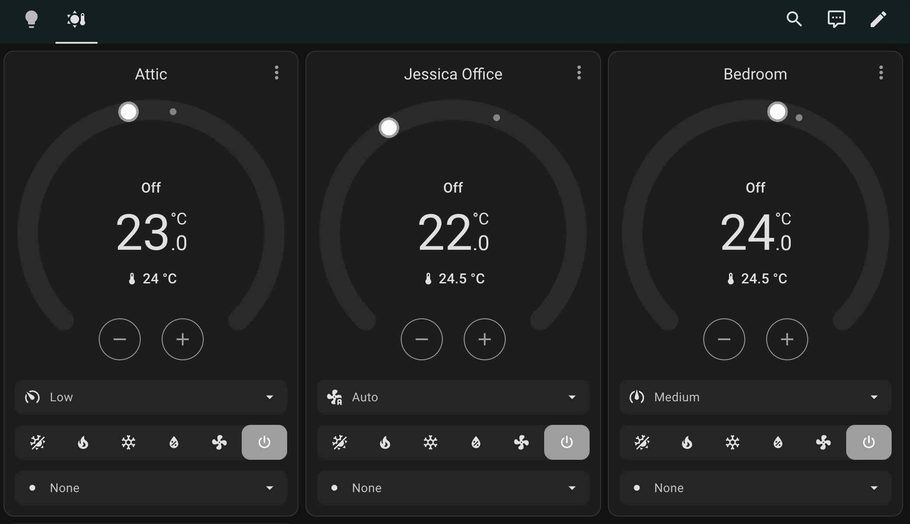
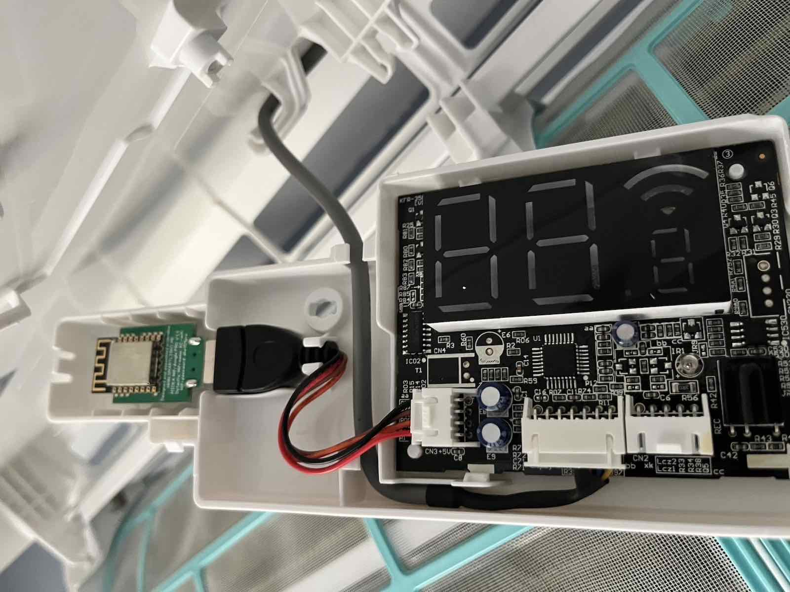

# How to connect Bosch HomeCom Easy air conditioning units to Home Assistant and Homekit?
If you have a smart air conditioning unit from Bosch with the HomeCom Easy app, you may be underwhelmed by how non-smart and difficult it is to use. 

Last year I installed a few of these in my house. One 5000i (1x1) and one 3000i (3x1). I bought the WiFi modules from the manufacturer, assuming they would integrate with any home automation system. I mean ... it's 2024. 

There's no local API, and you're locked into using the clunky official app. Who knows how long these cloud APIs will be maintained, before a new system is launched?

You also can't connect the app to Alexa, Apple Home, or Home Assistant. You're 100% locked to the vendor's app, which seems to be a bit abandoned. 

You _can_ sort of reverse engineer the API using something like Wireshark, but you still need to go through Boschs cloud service to control an AC unit just a few feet away. 

## So, how can I set it up in Home Assistant?

It's actually pretty simple. After some research online I saw that the boards are manufactured by Midea, who produce a lot of AC units from brands like Bosch, Electrolux, Beko, and many more.

Knowing this, it was highly likely that _any_ smart controller for Midea AC units would work.

I found [these controllers from Smartlight.me](https://smartlight.me/smart-home-devices/wifi-devices/wifi-dongle-air-conditioners-midea-idea-electrolux-for-home-assistant) (there are many other options). For less than 15$ it was cheap enough to test.

## Installation
I replaced the modules from Bosch with the above unit, and logged onto the temporary WiFi network it creates. I set it up on my IOT SSID, giving each unit a static IP. After about 2 minutes I tested adding them to Home Assistant with the ESP Home config, providing their local IP addresses and the default port. 

And (a bit surprisingly) it worked right out of the box. With all the units added to Home Assistant, I went ahead and added them to the HomeKit bridge in Home Assistant, and got them over in my Apple Home app. 

So far it has been very reliable, both in Home Assistant and in Apple Home. 

