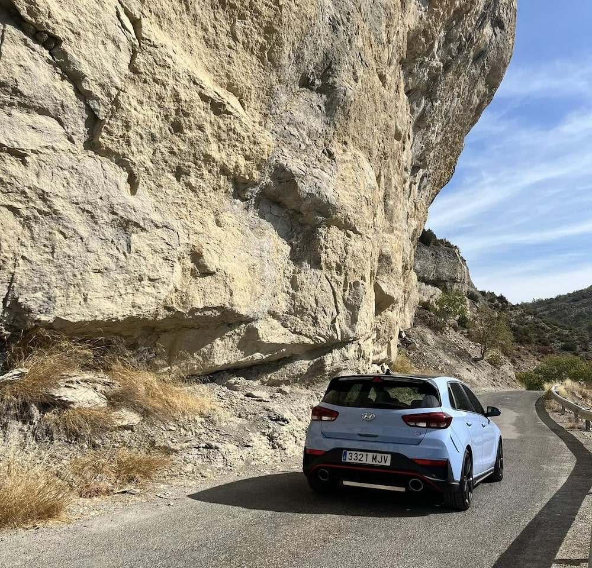
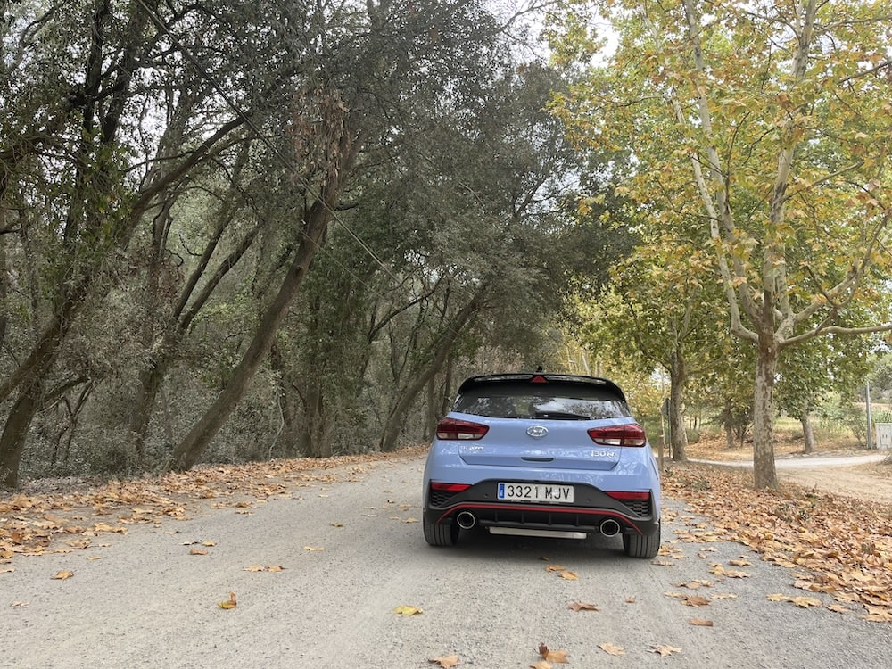
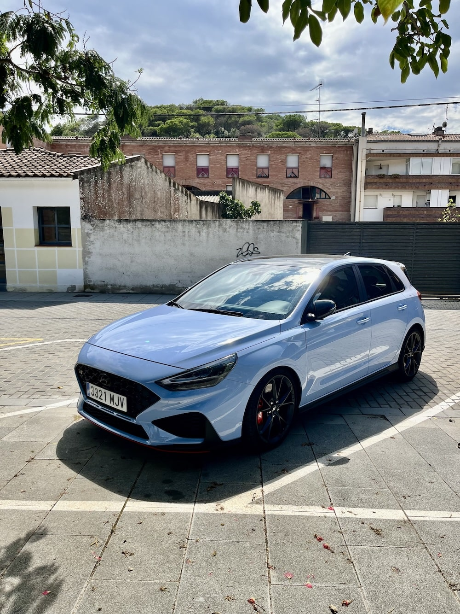

I've always loved cars. My dream car is still an 80s Porsche 911, but I'm pretty happy with my current daily driver: my 2023 Huyundai i30N Performance. In the correct color, of course: Performance Blue. 

It's a lot of fun, with the 2.0L turbocharged, 280hp engine and the 8-speed dual-clutch automatic transmission I prefer it over the Golf GTI and other "hot hatches". Looking at new EU rules, it's also likely my last non-EV.

Since I work remotely, I don't need a car. It's 100% unnecessary. Most days, if I go to a coworking, or to Barcelona, I take my motorbike. But most days, my commute is about 20 steps, 100 if I make coffee first. For road trips, having a fun car is perfect, though.

Every time we go on a road trip, I take some pictures of my car at different places!

<figure>

<figcaption>Under a big old rock in the Catalan mountains</figcaption>
</figure>

<figure>

<figcaption>In France</figcaption>
</figure>

<figure>

<figcaption>Near Berga, Catalunya</figcaption>
</figure>

<figure>

<figcaption>In Perafita, Catalunya</figcaption>
</figure>

<figure>

<figcaption>Lunch stop on the way to Andorra</figcaption>
</figure>

<figure>

<figcaption>At a farm in Catalunya</figcaption>
</figure>

<figure>

<figcaption>From the balcony in Perpignan, France</figcaption>
</figure>

<figure>

<figcaption>I can't remember where this is</figcaption>
</figure>
